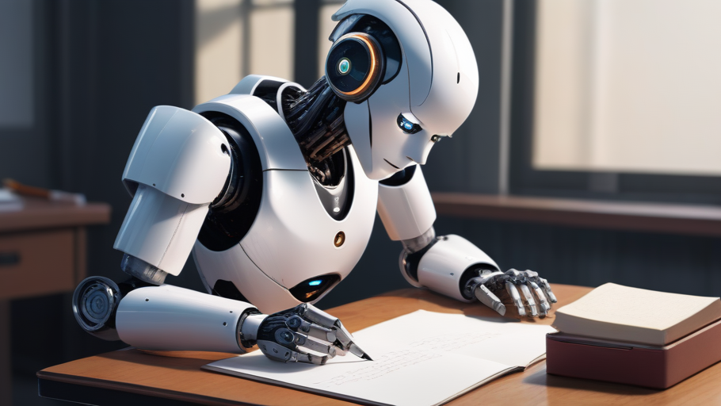

#  Influencia de las IAs en el aprendizaje humano

## La nueva era de la enseñanza

#### por Adrian Mosquera Alvarez

:smile:

---

La **inteligencia artificial (IA)** es tá transformando profundamente la manera en que los seres humanos aprenden.

Gracias a herramientas impulsadas por **IA** , como <ins>tutores virtuales, plataformas de aprendizaje personalizadas y asistentes inteligentes</ins>, los estudiantes pueden acceder a contenidos adaptados a su ritmo, estilo y necesidades específicas. **_Esto permite un aprendizaje más eficiente y personalizado_** 

---

---

Además, la IA facilita el análisis de grandes cantidades de datos educativos, lo que ayuda a identificar fortalezas y debilidades en los procesos de enseñanza y aprendizaje. **Sin embargo**, también plantea desafíos, ~~como la posible dependencia excesiva de la tecnología o la pérdida de habilidades críticas como la memoria o el pensamiento analítico~~.

Este archivo README.md puede encontrarlo en el siguiente enlace [enlace](https://github.com/amosqueraalvarez/MarkDown)

**PROS DE LA INTELIGENCIA ARTIFICIAL EN LA ENSEÑANZA**

- Rapido acceso a cualquier informacion
- Ayuda en cada momento

[documento](datos.txt)

[carpeta de imagenes](colores.txt)

>[!CAUTION]
> Cuidado